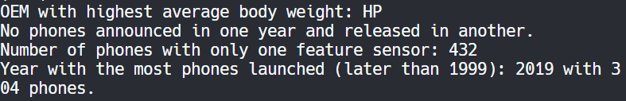

I chose Python for its simplicity, readability, and extensive library support. Python offers features for object-oriented programming , file ingestion, conditional statements, assignment statements, loops, subprograms, unit testing, and exception handling. 

The project involves reading data from a CSV file containing information about cell phones and performing various data operations and analyses. The Cell class is defined to represent individual cell phone entries, with methods for parsing and cleaning data attributes such as launch year, body weight, and display size. The csv module is utilized for efficient CSV file reading, while the re module is employed for regular expression-based string parsing. 

Data analysis methods are implemented to extract insights from the dataset, such as identifying the company with the highest average phone body weight, detecting phones announced in one year and released in another, counting phones with only one feature sensor, and finding the year with the most phone launches after 1999. Custom test functions are included to ensure data integrity and correctness of transformations. 

Three libraries used in this project are csv, re, and collections.defaultdict. The csv module facilitates CSV file handling, re is used for string parsing with regular expressions, and collections.defaultdict assists in averaging body weights by OEM. Each library was chosen for its efficiency and suitability for the respective task. 

